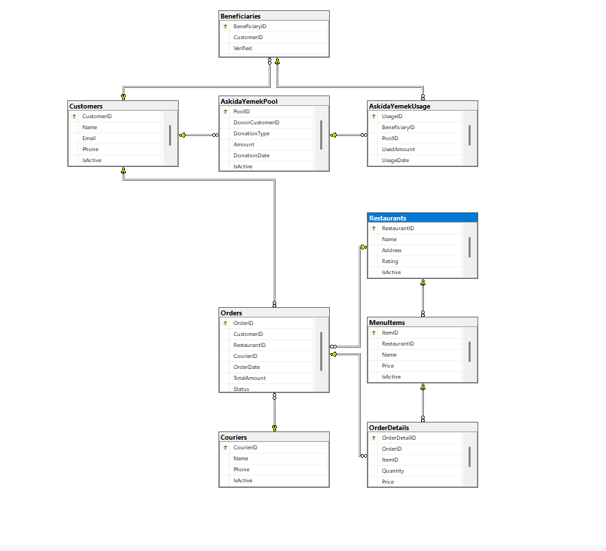

# ER Diyagramı

---

## İş Kuralları
1. Müşteri birden fazla sipariş verebilir.
2. Restoran birden fazla menü ürünü sunabilir.
3. Sipariş birden fazla ürün içerebilir.
4. Kurye birden fazla sipariş taşıyabilir.
5. Askıda Yemek modülünde bağış yapan müşteri havuza ekleme yapar.
6. Doğrulanmış ihtiyaç sahibi havuzdan kullanım yapabilir.
7. IsActive kolonları ile soft delete mantığı uygulanır.
8. Trigger’lar sistemde otomatik güncellemeleri sağlar.

---

## Yapay Zeka Kullanım Beyanı
Bu projede SQL kodlarının hatalarını test etmek, tabloların mantığını tartışmak ve  
parça parça GitHub commit planı oluşturmak için Microsoft Copilot’tan destek aldım.  
Kodları kendim çalıştırarak test ettim ve her satırın mantığını öğrendim.  
AI sadece asistan olarak kullanıldı, proje tamamen benim tarafımdan anlaşılarak geliştirildi.